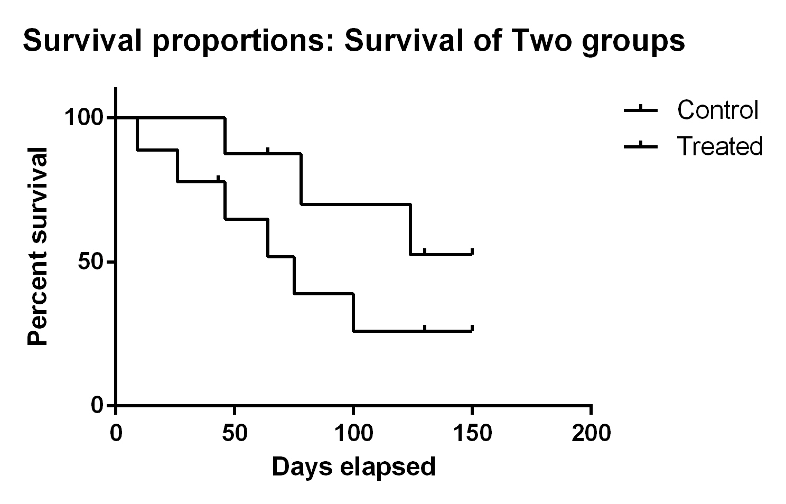
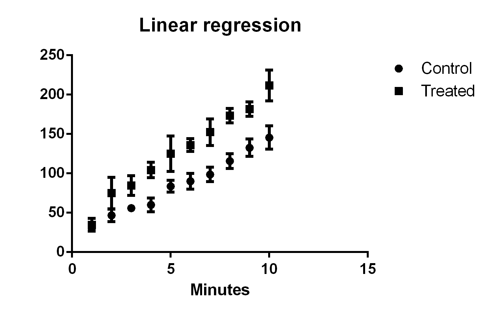
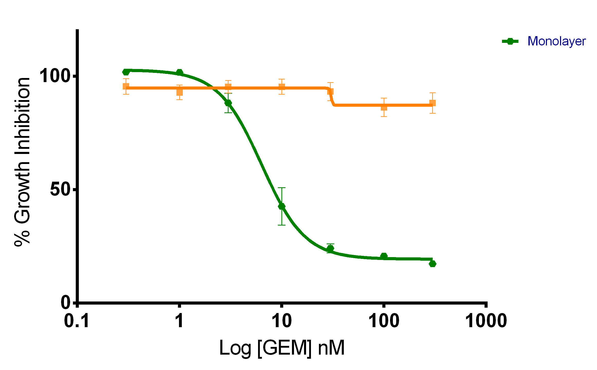

#Introducing the plot function

## Introducing the dataset

Data describing weather conditions in New York City in 1973 were obtained from the [supplementary data](http://faculty.washington.edu/heagerty/Books/Biostatistics/index-chapter.html) to *Biostatistics: A Methodology for the Health Sciences*


```{r echo=FALSE}
if(!file.exists("data/ozone.csv")) download.file(url = "http://faculty.washington.edu/heagerty/Books/Biostatistics/DATA/ozone.csv", destfile = "data/ozone.csv")
```


You can load these data into Excel for reference

##Reading the data

Like other programs, we need to specify some details about the file when we read it in


```{r echo=FALSE,fig.width=4,fig.height=4}
library(png)
library(grid)
img <- readPNG("images/dataImport.png")
grid.raster(img)
```

##Reading the data

- File location
- Column *separator*
- Use column headings in file?
- Skip any rows?

##Reading the data

To import these data into R we use the `read.csv` function, which will create a *data-frame* representation

- Many examples of reading data given in the course manual 
```{r}
data <- read.csv("data/ozone.csv")
```

##Reading the data

If we don't know where the file is located, we can use the `file.choose` function

```{r eval=FALSE}
myfile <- file.choose()
data <- read.csv(myfile)
```


## Exploring the data

You should **always check** that the data have been imported correctly by previewing and checking the *dimensions*.


```{r}
head(data)
dim(data)
```

## Exploring the data

```{r}
summary(data)
str(data)
```

##Data representation

The data are stored in a data frame. These are subset using square brackets `[]`

e.g. print rows 1 to 10 from the first column
```{r}
data[1:10,1]
```

##Data representation

We can get entire columns and rows by *omitting* the row or column index. The result is a `vector`

```{r}
data[1,]
data[,1]
```

##Data representation

The data frame is *not altered*

```{r}
dim(data)
data[1,]
dim(data)
```

##About NA

- You may have noticed some `NA` entries in the vector
- This is R's way of denoting *missing values*
- They can cause problems when we try and calculate averages. Most functions have an `na.rm` option
- Can also use `na.omit`

##Thinking about the data
What variables do we have?

- Ozone, Wind, Temp (Continuous)
- Month, Day (Discrete)

What are we interested in?

- Trend
- Relationship

Any repeated observations?

- No

##Thinking about the plot


```{r eval=FALSE, echo=FALSE}
library(ggplot2)
library(xkcd) 
xrange <- range(data$Ozone,na.rm = TRUE) 
yrange <- range(data$Temp,na.rm=TRUE) 
  
p1 <- ggplot(data=data, aes(x=Ozone, y=Temp)) +  
        geom_point(shape=20) +                                                  # use solid circles 
    xkcdaxis(xrange,yrange) +                                           # plot the xkcd-styled axis 
        xlab("Ozone Level") +                # label the x-axis 
        ylab("Temperature")                                                # label the y-axis 
ggsave(p1,file="plotSketch.png")

```

```{r echo=FALSE,fig.width=8,fig.height=3}
library(png)
library(grid)
img <- readPNG("images/plotSketch.png")
grid.raster(img)
```

##Thinking about the plot

A figure consists of

- Data points; each defined by an *x* and *y* coordinate
- Axes; defining the range of the data and a label
- Title

```{r echo=FALSE,fig.width=4,fig.height=2}
library(png)
library(grid)
img <- readPNG("images/plotSketch.png")
grid.raster(img)
```


##Assignment to a variable

- We can extract named columns from a data frame using the `$` operator

- The result is a `vector`

```{r}
ozone <- data$Ozone
```


##Scatter plots 

Suppose we want to look at the change in Ozone level (continuous)

- `plot` is the general-purpose plotting function in R
- Given a *vector* it will plot the values in the vector on the **y** axis, and index on the **x** axis
- It will create axes and labels automatically
```{r fig.width=8,fig.height=4}
plot(data$Ozone)
```

##Scatter plots 

- We have `r nrow(data)` points on the plot
- Axis labels, points, title and colours can be altered (see later)

```{r fig.width=8,fig.height=4}
plot(data$Ozone)
```


##Data visualisation

- Can plot one vector against another
- First *argument* is plotted on the x axis, second *argument* on the y axis

```{r fig.width=8,fig.height=4}
plot(data$Ozone,data$Temp)
```

##Other ways of visualising a vector

If we were interested in the *distribution* of the data, we could use a histogram
```{r}
hist(data$Ozone)
```


#Visualising Distributions

##The dataset

We have made some observations of cell in different conditions

- Three different groups (categories) in the dataset
- Repeated measurements for each group
- Are the data distributed differently in the different groups?

```{r}
data <- read.delim("data/plasma.txt")
data
```

##The boxplot

If given a data frame, `boxplot` will summarize each column separately and construct the box from the quantiles. Again, the axes and labels are automatically decided

```{r fig.width=8,fig.height=4}
boxplot(data)
```


##Plotting individual points

The `stripchart` or `dotchart` functions can be used to visualise individual points

```{r fig.width=8,fig.height=4}
stripchart(data)
```

##Plotting individual points

The `stripchart` or `dotchart` functions can be used to visualise individual points

```{r fig.width=8,fig.height=4}
dotchart(as.matrix(data))
```

##Plotting individual points

- `vertical = TRUE` ensures the plot is in the same orientation as the boxplot

```{r fig.width=8,fig.height=4}
stripchart(data,vertical=TRUE)
```

##Plotting individual points

- We can *stack* or *jitter* points if required

```{r fig.width=8,fig.height=4}
stripchart(data,vertical=TRUE,method="jitter")
```

##Plotting individual points

- We can *stack* or *jitter* points if required

```{r fig.width=8,fig.height=4}
stripchart(data,vertical=TRUE,method="stack")
```


##Overlaying points

- `add=TRUE` argument overlays the stripchart on an existing plot

```{r fig.width=8,fig.height=4}
boxplot(data)
stripchart(data,vertical=TRUE,add=TRUE)

```


##Summarising the data

```{r}
summary(data)
```


##Bar plots

To display the data as a barplot, we need to compute the mean of each *column*. The `colMeans` function is convenient for this.

```{r fig.width=8,fig.height=4}
barplot(colMeans(data))
```

N.B. see also `rowMeans`, `colSums`, `rowSums`

##Calculating error bars

To add *error bars* we need to calculate the standard deviations

```{r}
sd(data$Untreated)
sd(data$Placebo)
sd(data$Treated)
```


##Adding error bars

Possible, but recall earlier discussion
```{r echo=FALSE}
dpPlot <- function(data){
  
  mns <- colMeans(data,na.rm=TRUE)
  sds <- apply(data, 2, sd, na.rm=TRUE)
  
  err <- mns + sds
  xs <- barplot(mns,ylim=c(0, max(err)),axes=F)
  
  arrows(xs, mns, xs, err,code=3,angle=90)
  axis(2,at=pretty(0:floor(max(err))))
}
```

```{r}
dpPlot(data)
```


##We can still overlay points

```{r echo=FALSE,fig.show='hide'}
bp <- barplot(colMeans(data))

```

```{r echo=FALSE}
dpPlot(data)
points(rep(bp, each=nrow(data)), unlist(data))
```

##Histograms

You can also make a histogram 
- (not very useful in this case)

```{r fig.width=8,fig.height=4}
hist(data$Untreated)
```

##About data formats

- We produce boxplots from data in this format
- Each group of interest is in a different column
```{r}
data <- read.delim("data/plasma.txt")
data
```

##About data formats

- Given what we know so far, what format should the data for this plot be in?

```{r echo=FALSE,fig.width=8,fig.height=2}
data <- read.csv("data/ozone.csv")
boxplot(data$Ozone~data$Month)
```

```{r, echo=FALSE}
df <- data.frame(Month1 = c(41,36,12), Month2 = c(NA,NA,NA), Month3 = c(135,49,32))
df
```


##A note about 'long data'

- Recall our weather data
- We do not have separate columns for each month
- Ozone observations are *stacked* on top of each other
- There is an *indicator* variable to tell us the month
- This is know as 'long data'

```{r}
data <- read.csv("data/ozone.csv")
head(data)
```

##Boxplot of long data

- Month is a variable in the data frame
- We use *formula* syntax with the `~` symbol. e.g. `y ~ x`

```{r}
boxplot(data$Ozone~data$Month)
```

##Boxplot of long data

```{r}
boxplot(data$Temp~data$Month)
```

##stripchart of long data

```{r}
stripchart(data$Ozone~data$Month,vertical=TRUE)
```

##Boxplot of long data

```{r}
boxplot(data$Ozone~data$Month)
stripchart(data$Ozone~data$Month,vertical=TRUE,add=TRUE)
```

##Boxplot of long data

- This is equivalent and a bit more concise
```{r}
boxplot(Ozone~Month,data)
stripchart(Ozone~Month,data,vertical=TRUE,add=TRUE)
```

#Count data

##Making a barplot

- Often we have to make a table before constructing a bar plot

```{r fig.width=8,fig.height=4}
clinical <- read.delim("data/NKI295.pdata.txt")
table(clinical$ER)
barplot(table(clinical$ER))
```


##Stacking 

```{r fig.width=8,fig.height=4}
counts <- table(clinical$ER,clinical$grade)
counts
barplot(counts, legend = rownames(counts))
```

##Grouping 

```{r fig.width=8,fig.height=4}
counts <- table(clinical$ER,clinical$grade)
barplot(counts,beside=TRUE,legend=rownames(counts))
```

#Curves

##Survival curves



##Survival curves


To perform a survival analysis we need the following pieces of information

- Time to Event
- Event (e.g. dead or alive)
- Group

##Example data

```{r}
clinical <- read.delim("data/NKI295.pdata.txt")

Event <- clinical$event_death
Time <- clinical$survival.death.
Group <- clinical$ER

```

##The survival package

```{r}
library(survival)
survData <- Surv(Time, Event)
survData[1:10]
```


##Making the Survival curve

```{r}
plot(survfit(survData ~ Group))
```


##Survival data in Prism

- Prism uses a special format to represent survival data
- See practical for details

```{r}
sdata <- read.delim("data/Two groups.txt")
head(sdata)
```


##Growth Curve

Goal is to produce following 


##Growth Curve

```{r}
data <- read.delim("PrimerExamples/Linear regression.txt")
head(data)
```


##Procedure

- Gather columns together according to *group*
- Calculate avearge values for each time point
- Calculate a variability measurement (e.g. standard deviation)
- Plot averages with error bars
- Smooth curve through the points


##Shortcut

- We have implemented this in the `crukCIMisc` package that accompanies this course - `prismTimeSeries`
- See practical for example 

```{r eval=FALSE}
install.packages("devtools")
library(devtools)
install_github(repo = "crukCIMisc", 
               username = "markdunning")
library(crukCIMisc)
```


##Dose response

Goal is to produce following 


##Another shortcut

- Data are *similar* format as previous example
- see `prismDoseResponse` in `crukCIMisc`
- See package `drc` for more in-depth analysis
- `install.packages(drc)`

#Break for practical 